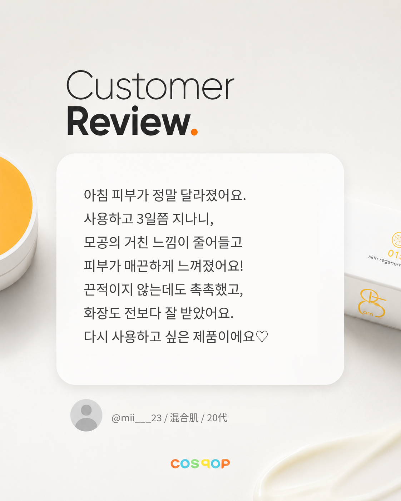
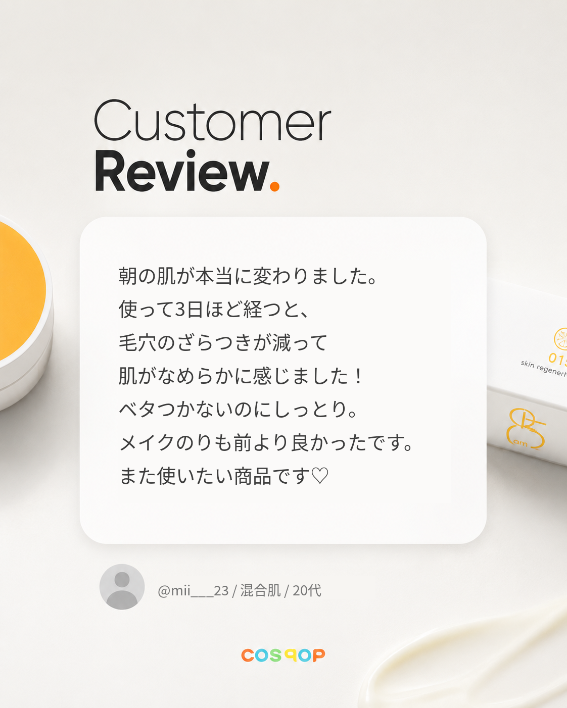

# LLM Japanese Review Card Pipeline

한국어 화장품 리뷰를 일본 소비자용 카피로 현지화하고, 고정 디자인 템플릿에 합성해 SNS 리뷰 카드로 만드는 Python 프로젝트입니다.

단순 번역 API 호출이 아니라 **원문 의미 보존**, **일본어 후기 말투**, **이미지 슬롯의 줄 수·글자 수 제한**을 함께 다룹니다. 의미와 문체는 LLM이 판단하고, 좌표·폰트·줄바꿈·이미지 합성은 결정론적 코드가 책임집니다.

## 해결하려는 문제

- 직역된 화장품 리뷰는 일본 소비자가 실제로 작성한 후기처럼 읽히지 않습니다.
- 생성형 이미지 모델에 일본어를 직접 그리게 하면 글자가 깨지고 레이아웃이 흔들립니다.
- 자연스러운 문장도 정해진 카드 영역을 넘으면 디자인 결과물로 사용할 수 없습니다.
- LLM이 원문에 없는 사용 기간이나 효능을 추가하면 콘텐츠를 신뢰하기 어렵습니다.

## 파이프라인

```text
한국어 리뷰 CSV
  → 템플릿 좌표로 줄 수·줄당 글자 수 계산
  → OpenAI Responses API Localizer
  → Pydantic 응답 계약 검증
  → 독립 Reviewer 프롬프트
      ├─ pass: 렌더링
      └─ revise: 지적 기반 1회 수정 → 재검수
  → Pillow 일본어 금칙처리·폰트 맞춤·이미지 합성
  → localized.csv + PNG + API/검수 메타데이터
```

### LLM이 담당하는 부분

- 한국어 리뷰의 주장과 경험을 보존한 일본어 현지화
- 타깃 독자와 브랜드 톤 반영
- 원문에 없는 효과·수치·추천 표현 추가 여부 검수
- 레이아웃 제한을 넘는 문장 축약

### 코드가 담당하는 부분

- 템플릿과 참조 이미지 사전검증
- 슬롯 좌표 기반 길이 제한 계산
- 일본어 금칙처리와 폰트 크기 조절
- 비포·애프터 사진 cover-crop 및 PNG 합성
- 프롬프트 버전, 토큰, 지연시간, 리뷰 점수 기록

## 실행

Python 3.11이 필요합니다. LaMa의 Pillow 제약 때문에 3.12 이상은 지원하지 않습니다.

```bash
python3.11 -m venv .venv
source .venv/bin/activate
pip install -e '.[dev]'
cp .env.example .env
# .env에 OPENAI_API_KEY 입력
```

## 실제 사용 예시

2026-07-19 실제 API 스모크에 사용한 첫 번째 입력입니다. `review_text_ko`의 `\n`은 카드에 유지할 줄바꿈입니다.

### 실제 실행 이미지

왼쪽은 한국어 원문을 고정 템플릿에 렌더링한 변환 전 카드이고, 오른쪽은 같은 원문을 `gpt-5.6-sol`로 현지화·검수한 실제 출력입니다. 배경·좌표·폰트 스타일은 유지하고 리뷰 텍스트만 교체했습니다.

| Input — 한국어 원문 카드 | Output — 일본어 현지화 카드 |
| --- | --- |
|  |  |

### Input — `sample_reviews_ko.csv`

```csv
template,review_text_ko,handle,skin_type,age,audience,brand_tone,output_name
customer_review,"아침 피부가 정말 달라졌어요.\n사용하고 3일쯤 지나니,\n모공의 거친 느낌이 줄어들고\n피부가 매끈하게 느껴졌어요!\n끈적이지 않는데도 촉촉했고,\n화장도 전보다 잘 받았어요.\n다시 사용하고 싶은 제품이에요♡",@mii___23,混合肌,20代,20~30대 일본 여성,과장 없이 친근한 실제 사용자 후기,llm_customer_review.png
```

### Run

```bash
localize-reviews \
  --csv sample_reviews_ko.csv \
  --limit 1 \
  --render
```

### Output — `localized.csv`

Localizer가 생성하고 Reviewer가 승인한 실제 일본어 결과입니다.

```text
朝の肌が本当に変わりました。
使って3日ほど経つと、
毛穴のざらつきが減って
肌がなめらかに感じました！
ベタつかないのにしっとり。
メイクのりも前より良かったです。
また使いたい商品です♡
```

### Output — `localization.meta.json`

```json
{
  "template": "customer_review",
  "review": {
    "verdict": "pass",
    "score": 98,
    "source_fidelity": true,
    "naturalness": true,
    "constraint_fit": true
  },
  "execution": {
    "status": "pass",
    "revision_count": 0,
    "api_calls": 2,
    "token_usage": { "total": 3111 },
    "latency_ms": 21924
  }
}
```

### 생성 파일

```text
artifacts/<UTC timestamp>/
├── localized.csv
├── localization.meta.json
└── images/
    └── llm_customer_review.png  # 1122×1402, 잘림·오버플로우 없음
```

실행 결과의 검수·비용 지표를 요약할 수 있습니다.

```bash
python evals/evaluate_run.py artifacts/<run>/localization.meta.json
```

## 검증

```bash
pytest -q
ruff check .
python review_card.py --csv sample_reviews.csv --validate-only
```

2026-07-19 실제 API 스모크에서는 1건이 Reviewer 98점으로 통과했고, 2회 API 호출 후 PNG까지 생성됐습니다. 상세 수치는 [검증 기록](docs/validation.md)에 남겼습니다.

## Papago 기준선

[translate_image.py](translate_image.py)는 기존 CLOVA OCR → Papago → LaMa → Pillow 경로입니다. 삭제하지 않고 LLM 현지화와 비교할 기준선으로 유지합니다. 좌표 추출과 렌더링 헬퍼도 새 파이프라인에서 재사용합니다.

## 구조

- `localization/contracts.py` — Pydantic 입출력 계약
- `localization/prompts.py` — 버전이 지정된 Localizer·Reviewer·Revision 프롬프트
- `localization/openai_gateway.py` — Responses API 호출과 사용량 수집
- `localization/pipeline.py` — 현지화·검수·1회 수정 오케스트레이션
- `localize_reviews.py` — CSV 배치 진입점과 결과 번들 생성
- `review_card.py`, `jp_layout.py` — 결정론적 이미지 렌더링
- `evals/` — 실행 결과 품질·토큰·지연시간 요약
- `tests/` — API 없이 실행되는 계약·파이프라인·렌더 사전검증 테스트

## 현재 한계

- LLM Reviewer 점수는 일본어 원어민 평가를 대체하지 않습니다.
- 효능 표현 경고는 법률·광고 심의 판단이 아니며 최종 검토가 필요합니다.
- macOS Noto Sans CJK JP 폰트 경로를 기본값으로 사용합니다.
- 기존 템플릿 2종은 원본 빈 프레임이 없어 과거 출력 이미지를 브리지 자산으로 사용합니다.
